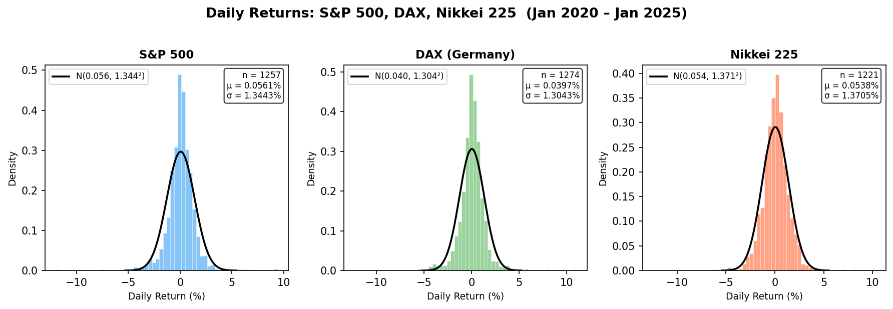
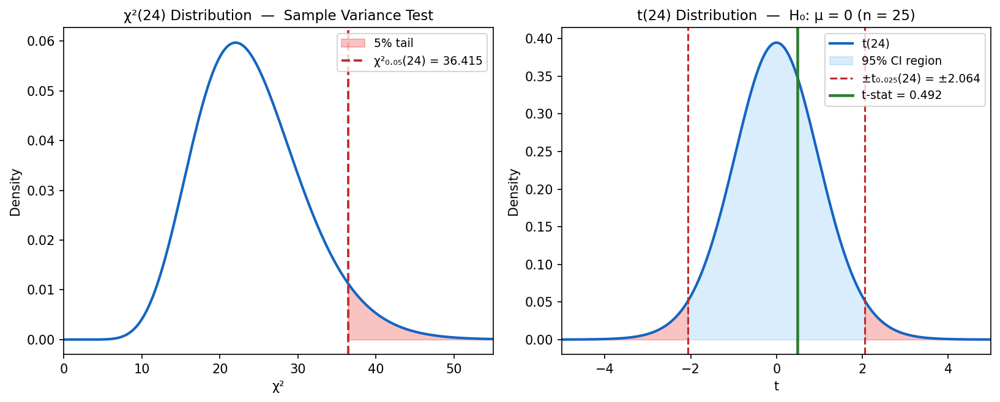

## 🎯 Learning Objectives

::: {style="font-size: 35px"}
::: {.learning-objectives}
By the end of this lecture, you will be able to:

- **Define** a *statistic* and its *sampling distribution* and explain why they matter for inference about economic and financial populations

- **Apply** Theorem 7.1 to derive the sampling distribution of the sample mean $\bar{Y}$ from a normal population

- **Compute** probabilities involving $\chi^2$, $t$, and $F$ distributions using their definitions and relationship to normal samples

- **Interpret** how the $\chi^2$ distribution governs sample variance $S^2$ and connect it to risk measurement in portfolios

- **Compare** the $t$ and $F$ distributions to the standard normal and explain their role in small-sample inference for economic data
:::
:::


## 📱 Attendance Check-in {.center background-color="#f0f4ff"}

<div class="attendance-qr" data-status="present" id="qr-present" style="min-height: 400px; display: flex; align-items: center; justify-content: center;"></div>

## 📋 Overview

::: {style="font-size: 38px"}
::: {.callout-note}
## 📚 Topics Covered Today

::: {.incremental}
- **Statistics & Sampling Distributions** – From data to inference

- **Distribution of $\bar{Y}$** – Theorem 7.1 and the normal population

- **The $\chi^2$ Distribution** – Sum of squared normals and sample variance

- **Student's $t$ Distribution** – When $\sigma$ is unknown

- **The $F$ Distribution** – Comparing two variances

- **Case Study** – Analyzing stock return volatility with Python
:::
:::
:::


## 📖 Why Sampling Distributions?

::: {style="font-size: 34px"}
::: {.callout-note}
## 🎯 Motivation

Every day, analysts and economists make decisions based on *samples*, not entire populations. Understanding how sample statistics behave is the foundation of statistical inference.

::: {.columns}
::: {.column width="50%"}
::: {.fragment}
**Finance & Business Applications:**

- Estimating average portfolio returns from historical data
- Testing whether a fund's Sharpe ratio exceeds a benchmark
- Comparing volatility of two asset classes
- Quality control in manufacturing output
:::
:::

::: {.column width="50%"}
::: {.fragment}
**Economics & Policy Applications:**

- Estimating mean household income from survey samples
- Testing effectiveness of a policy intervention (e.g., tax reform)
- Comparing GDP growth rates across regions
- Measuring inflation variability across time periods
:::
:::
:::
:::

**Key Question:** If we draw a sample and compute $\bar{Y}$, $S^2$, or a ratio of variances, *what probability distribution do these statistics follow?*
:::


## 📖 Definition: Statistic

::: {style="font-size: 34px"}
::: {.callout-note}
## 📝 Definition 7.1: Statistic

A **statistic** is a function of the observable random variables in a sample and known constants.

$$T = g(Y_1, Y_2, \ldots, Y_n)$$

**Interpretation:** A statistic transforms raw sample data into a single number used for inference.
:::

::: {.fragment}
**Common Statistics You Already Know:**

| Statistic | Formula | Use |
|-----------|---------|-----|
| Sample Mean | $\bar{Y} = \frac{1}{n}\sum_{i=1}^n Y_i$ | Estimate $\mu$ |
| Sample Variance | $S^2 = \frac{1}{n-1}\sum_{i=1}^n (Y_i - \bar{Y})^2$ | Estimate $\sigma^2$ |
| Sample Range | $R = Y_{(n)} - Y_{(1)}$ | Measure spread |
:::
:::


## 📖 Sampling Distributions: The Big Picture

::: {style="font-size: 34px"}
::: {.fragment}
**Key Insight:** Because $Y_1, Y_2, \ldots, Y_n$ are random variables, any statistic $T = g(Y_1, \ldots, Y_n)$ is **also a random variable** with its own probability distribution.
:::

::: {.fragment}
::: {.callout-important}
## The Sampling Distribution

The **sampling distribution** of a statistic is the probability distribution of that statistic computed over all possible samples of size $n$ from the population.

It is the theoretical model for the relative frequency histogram we would observe through *repeated sampling*.
:::
:::

::: {.fragment}
**Economic Analogy:** Imagine surveying 50 households about monthly spending. Each time you draw a new sample, you get a different $\bar{Y}$. The distribution of all possible $\bar{Y}$ values *is* the sampling distribution.
:::
:::


## 📌 Example: Rolling Dice — A Warm-Up

::: {style="font-size: 34px"}
**Problem:** A balanced die is tossed $n = 3$ times. Let $Y_1, Y_2, Y_3$ be the results. What are $E(\bar{Y})$ and $\sigma_{\bar{Y}}$?

::: {.fragment}
**Solution:** For a balanced die, $\mu = E(Y_i) = 3.5$ and $\sigma^2 = V(Y_i) = 2.9167$.
:::

::: {.fragment}
Since the $Y_i$ are independent:

$$E(\bar{Y}) = \mu = 3.5$$
:::

::: {.fragment}
$$V(\bar{Y}) = \frac{\sigma^2}{n} = \frac{2.9167}{3} = 0.9722 \implies \sigma_{\bar{Y}} = 0.986$$
:::

::: {.fragment}
::: {.callout-tip}
## 💡 Key Takeaway
$\bar{Y}$ has **less variability** than individual observations — by a factor of $1/\sqrt{n}$. This is why averaging *works* in economics: polling more people, collecting more price data, or observing more trading days all reduce estimation error.
:::
:::
:::


## 🧮 Theorem 7.1: Distribution of $\bar{Y}$

::: {style="font-size: 34px"}
::: {.callout-important}
## Theorem 7.1: Sampling Distribution of the Mean (Normal Population)

Let $Y_1, Y_2, \ldots, Y_n$ be a random sample from a **normal** distribution with mean $\mu$ and variance $\sigma^2$. Then:

$$\bar{Y} = \frac{1}{n}\sum_{i=1}^n Y_i$$

is **normally distributed** with:

$$\mu_{\bar{Y}} = \mu \qquad \text{and} \qquad \sigma^2_{\bar{Y}} = \frac{\sigma^2}{n}$$
:::

::: {.fragment}
**Immediate Consequence:** The standardized version

::: {style="margin-top:-40px;"}
$$Z = \frac{\bar{Y} - \mu}{\sigma / \sqrt{n}}$$

:::

::: {style="margin-top:-40px;"}

has a **standard normal** distribution. This is the workhorse for inference when $\sigma$ is known.

:::
:::
:::


## 📌 Example: GDP Growth Estimation

::: {style="font-size: 32px"}
**Problem:** Quarterly GDP growth rates in a stable economy are normally distributed with $\sigma = 0.8\%$. A sample of $n = 16$ quarters yields $\bar{Y}$. Find $P(|\bar{Y} - \mu| \leq 0.3)$.

::: {.fragment}
**Solution:** By Theorem 7.1, $\bar{Y} \sim N(\mu,\; \sigma^2/n)$, so:

$$Z = \frac{\bar{Y} - \mu}{\sigma/\sqrt{n}} = \frac{\bar{Y} - \mu}{0.8/\sqrt{16}} = \frac{\bar{Y} - \mu}{0.2}$$
:::

::: {.fragment}
$$P(|\bar{Y} - \mu| \leq 0.3) = P\!\left(\frac{-0.3}{0.2} \leq Z \leq \frac{0.3}{0.2}\right) = P(-1.5 \leq Z \leq 1.5)$$
:::

::: {.fragment}
$$= 1 - 2 \times P(Z > 1.5) = 1 - 2(0.0668) = \boxed{0.8664}$$
:::

::: {.fragment}
**Interpretation:** There is about an 87% chance that the sample mean growth rate will be within 0.3 percentage points of the true mean — a useful precision for macroeconomic forecasting.
:::
:::


## 📌 Example: Sample Size for Precision

::: {style="font-size: 32px"}
**Problem:** How many quarterly observations do we need so that $\bar{Y}$ is within 0.3% of $\mu$ with probability 0.95?

::: {.fragment}
**Solution:** We need $P(|\bar{Y} - \mu| \leq 0.3) = 0.95$, which requires:

$$P\!\left(-\frac{0.3}{\sigma/\sqrt{n}} \leq Z \leq \frac{0.3}{\sigma/\sqrt{n}}\right) = 0.95$$
:::

::: {.columns}
::: {.column width="50%" .fragment}
This means $\frac{0.3}{\sigma/\sqrt{n}} = z_{0.025} = 1.96$, so:

$$\sqrt{n} = \frac{1.96 \times 0.8}{0.3} = 5.227 \implies n = 27.32$$

:::


::: {.column width="50%" .fragment}
$$\boxed{n = 28 \text{ quarters (7 years of data)}}$$

:::
:::

::: {.fragment}
**Policy Insight:** Regulators and central banks need multi-year data windows to achieve reliable growth estimates — this quantifies *exactly* how long.
:::
:::


## 🧮 The $\chi^2$ Distribution

::: {style="font-size: 34px"}
::: {.callout-important}
## Theorem 7.2: Chi-Square from Normal Samples

Let $Y_1, \ldots, Y_n$ be a random sample from $N(\mu, \sigma^2)$. Then $Z_i = (Y_i - \mu)/\sigma$ are independent standard normals, and:

$$\sum_{i=1}^n Z_i^2 = \sum_{i=1}^n \left(\frac{Y_i - \mu}{\sigma}\right)^2 \sim \chi^2(n)$$
:::

::: {.columns}
::: {.column width="50%" .fragment}
**Properties of $\chi^2(\nu)$:**

- $E(\chi^2) = \nu$
- $V(\chi^2) = 2\nu$
- Right-skewed, but becomes more symmetric as $\nu$ increases
:::

::: {.column width="50%" .fragment}
**Finance Connection:**

The sum of squared deviations measures **total risk**. The $\chi^2$ distribution tells us how sample variance behaves — critical for VaR (Value at Risk) and portfolio risk estimation.
:::
:::
:::


## 🧮 Theorem 7.3: Distribution of $S^2$

::: {style="font-size: 34px"}
::: {.callout-important}
## Theorem 7.3: Sample Variance Distribution

Let $Y_1, \ldots, Y_n$ be a random sample from $N(\mu, \sigma^2)$. Then:

$$\frac{(n-1)S^2}{\sigma^2} = \frac{1}{\sigma^2}\sum_{i=1}^n (Y_i - \bar{Y})^2 \sim \chi^2(n-1)$$

**Moreover:** $\bar{Y}$ and $S^2$ are **independent** random variables.
:::

::: {.fragment}
**Why Does This Matter?**

- We lose 1 degree of freedom because we estimate $\mu$ with $\bar{Y}$
- This result is the foundation for confidence intervals for $\sigma^2$
- The independence of $\bar{Y}$ and $S^2$ is **surprising** and **crucial** — it enables the $t$-test
:::

::: {.fragment style="margin-top:-40px;"}
[**Consequence:** $E(S^2) = \sigma^2$ — the sample variance is an **unbiased** estimator of population variance.]{style="color: red;"}
:::
:::


## 📌 Example: Bond Yield Variability

::: {style="font-size: 32px"}
**Problem:** Daily changes in a government bond yield are $N(\mu, \sigma^2)$. From $n = 21$ trading days, we observe $S^2$. Find $b$ such that $P(S^2 \leq b) = 0.95$.

::: {.fragment}
**Solution:** By Theorem 7.3, $(n-1)S^2/\sigma^2 \sim \chi^2(20)$.
:::

::: {.fragment}
We need:

$$P\!\left(\frac{20S^2}{\sigma^2} \leq \chi^2_{0.05}(20)\right) = 0.95$$
:::

::: {.fragment}
From chi-square tables: $\chi^2_{0.05}(20) = 31.41$
:::

::: {.fragment}
$$\frac{20b}{\sigma^2} = 31.41 \implies b = \frac{31.41 \cdot \sigma^2}{20} = 1.571\sigma^2$$
:::

::: {.fragment}
**Risk Interpretation:** There is a 95% chance that the sample variance of bond yield changes won't exceed 1.571 times the true variance — useful for setting conservative risk bounds.
:::
:::


## 📖 Definition: Student's $t$ Distribution

::: {.columns}
::: {.column width="50%" style="font-size: 34px"}
::: {.callout-note}
## 📝 Definition 7.2: Student's $t$ Distribution

Let $Z \sim N(0,1)$ and $W \sim \chi^2(\nu)$ be **independent**. Then:

$$T = \frac{Z}{\sqrt{W/\nu}}$$

has a **$t$ distribution with $\nu$ degrees of freedom**.
:::

::: {.callout-note .fragment fragment-index="2" style="margin-top: 15px;font-size: 38px;"}
## 📜 Historical Note
William Sealy Gosset published this under the pseudonym "Student" in 1908 while working at Guinness Brewery — small samples of barley quality led to one of statistics' most important distributions.
:::
:::

::: {.column width="50%" style="font-size: 36px"}
::: {.fragment fragment-index="1"}
**Key Application:** For a normal sample:

$$T = \frac{\bar{Y} - \mu}{S/\sqrt{n}} = \sqrt{n}\left(\frac{\bar{Y} - \mu}{S}\right) \sim t(n-1)$$

This replaces 
$$Z = \frac{(\bar{Y}-\mu)}{\sigma/\sqrt{n}}$$ 
when $\sigma$ is **unknown** — which is *almost always* the case in economics!
:::
:::
:::


## 📖 $t$ vs. Normal: Heavier Tails

::: {style="font-size: 34px;margin-top: -30px;"}
::: {.columns}
::: {.column width="45%"}
**Properties of $t(\nu)$:**
 
- Symmetric about 0, bell-shaped
- $E(T) = 0$ for $\nu > 1$
- $V(T) = \frac{\nu}{\nu - 2}$ for $\nu > 2$  — **always > 1**
- Heavier tails than standard normal
- As $\nu \to \infty$, $t(\nu) \to N(0,1)$

::: {.callout-important .fragment style="margin-top: -30px;font-size: 38px;"}
**Economic Implication:** With small samples (common in macro and finance), using the normal distribution when $\sigma$ is unknown **underestimates** the uncertainty. The $t$ distribution corrects for this.
:::
:::


::: {.column width="55%"}
::: {.fragment}
**Why heavier tails?**

The extra variability comes from *estimating* $\sigma$ with $S$. In small samples, $S$ can be quite different from $\sigma$, inflating or deflating the ratio.

| $\nu$ (df) | $V(T)$ | How close to normal? |
|:---:|:---:|:---|
| 5 | 1.667 | Much wider tails |
| 10 | 1.250 | Noticeably wider |
| 30 | 1.071 | Nearly normal |
| 100 | 1.020 | Very close |
| $\infty$ | 1.000 | Exactly normal |
:::
:::
:::
:::


## 🎮 Interactive: N(0,1) vs. t — Tail Convergence {.smaller}

:::::: {style="font-size: 0.75em; margin-top: -8px;"}

**Key insight:** As $\nu \to \infty$, $t(\nu) \to N(0,1)$. The heavier tails reflect uncertainty in estimating $\sigma$ from data — watch them shrink as $\nu$ grows.

::::: columns
::: {.column width="25%"}

```{ojs}
//| echo: false

viewof nu_val = {
  const input = Inputs.range([1, 50], {
    value: 5, step: 1,
    label: "Degrees of freedom ν:"
  });
  ['pointerdown','touchstart','mousedown','click','wheel',
   'pointermove','touchmove'].forEach(e =>
    input.addEventListener(e, ev => ev.stopPropagation())
  );
  return input;
}

viewof zt_overlay_opt = {
  const input = Inputs.select(
    ["None", "Show ν = 3, 10, 30"],
    { label: "Compare curves:", value: "None" }
  );
  ['pointerdown','touchstart','mousedown','click'].forEach(e =>
    input.addEventListener(e, ev => ev.stopPropagation())
  );
  return input;
}

{
  function tpdf_fn(x, v) {
    const c = gamma_func((v+1)/2) / (Math.sqrt(v * Math.PI) * gamma_func(v/2));
    return c * Math.pow(1 + x*x/v, -(v+1)/2);
  }
  let tail = 0;
  for (let i = 0; i <= 2000; i++) {
    const x = 1.96 + (i / 2000) * 20;
    tail += tpdf_fn(x, nu_val) * (20 / 2000);
  }
  const tail_pct = (2 * Math.min(tail, 0.5) * 100).toFixed(1);
  const var_t = nu_val > 2 ? (nu_val / (nu_val - 2)).toFixed(3) : "∞";
  const conv = nu_val >= 30 ? "≈ Normal ✓" : nu_val >= 10 ? "Close" : "Distinct";
  return html`<div style="background:#eef6ff;padding:9px;border-radius:6px;line-height:1.8">
    <b>t(${nu_val}) Properties:</b><br/>
    V(T) = <b>${var_t}</b><br/>
    Shape: <b>${conv}</b>
    <hr style="margin:5px 0"/>
    <b>P(|X| &gt; 1.96):</b><br/>
    <span style="color:steelblue">●</span> t(${nu_val}): <b>${tail_pct}%</b><br/>
    <span style="color:crimson">— —</span> N(0,1): <b>5.0%</b>
    <hr style="margin:5px 0"/>
    <small style="color:#555">
      Blue solid = t(ν)<br/>
      Red dashed = N(0,1)<br/>
      Shaded = tail area |x|&gt;1.96
    </small>
  </div>`;
}
```

:::

::: {.column width="75%"}

```{ojs}
//| echo: false

zt_tpdf = (x, v) => {
  const c = gamma_func((v+1)/2) / (Math.sqrt(v * Math.PI) * gamma_func(v/2));
  return c * Math.pow(1 + x*x/v, -(v+1)/2);
}

zt_main_curve = Array.from({length: 401}, (_, i) => {
  const x = -5 + (i / 400) * 10;
  return { x, y: zt_tpdf(x, nu_val) };
})

zt_z_line = Array.from({length: 401}, (_, i) => {
  const x = -5 + (i / 400) * 10;
  return { x, y: Math.exp(-x*x/2) / Math.sqrt(2 * Math.PI) };
})

zt_left_tail = Array.from({length: 101}, (_, i) => {
  const x = -5 + (i / 100) * 3.04;
  return { x, y: zt_tpdf(x, nu_val) };
})

zt_right_tail = Array.from({length: 101}, (_, i) => {
  const x = 1.96 + (i / 100) * 3.04;
  return { x, y: zt_tpdf(x, nu_val) };
})

zt_compare_curves = {
  if (zt_overlay_opt === "None") return [];
  return [3, 10, 30].flatMap(v =>
    Array.from({length: 401}, (_, i) => ({
      x: -5 + (i / 400) * 10,
      y: zt_tpdf(-5 + (i / 400) * 10, v),
      label: `t(${v})`
    }))
  );
}

{
  const ymax = Math.max(...zt_main_curve.map(d => d.y)) * 1.15;
  return Plot.plot({
    width: 680,
    height: 420,
    marginLeft: 55,
    marginBottom: 45,
    marginTop: 35,
    x: { label: "x", domain: [-5, 5] },
    y: { label: "Density", domain: [0, ymax] },
    color: { legend: zt_overlay_opt !== "None" },
    title: `t(ν = ${nu_val}) vs N(0,1)  •  Shaded: tail area |x| > 1.96`,
    marks: [
      Plot.areaY(zt_left_tail,  { x: "x", y: "y", fill: "steelblue", fillOpacity: 0.25 }),
      Plot.areaY(zt_right_tail, { x: "x", y: "y", fill: "steelblue", fillOpacity: 0.25 }),
      zt_compare_curves.length > 0
        ? Plot.line(zt_compare_curves, { x: "x", y: "y", stroke: "label", strokeWidth: 1.5, strokeDasharray: "4,2", opacity: 0.75 })
        : null,
      Plot.line(zt_z_line,     { x: "x", y: "y", stroke: "crimson",   strokeWidth: 2,   strokeDasharray: "6,4" }),
      Plot.line(zt_main_curve, { x: "x", y: "y", stroke: "steelblue", strokeWidth: 2.5 }),
      Plot.ruleX([-1.96, 1.96], { stroke: "#aaa", strokeDasharray: "3,2" }),
      Plot.ruleY([0], { stroke: "#e0e0e0" })
    ].filter(Boolean)
  });
}
```

:::
:::::
::::::


## 📌 Example: Estimating Average Firm Size

::: {style="font-size: 32px"}
**Problem:** Annual revenues of firms in a sector are $N(\mu, \sigma^2)$. A sample of $n = 6$ firms gives $\bar{Y}$ and $S$. Find $P\!\left(|\bar{Y} - \mu| \leq 2\frac{S}{\sqrt{n}}\right)$.

::: {.fragment}
**Solution:**

$$P\!\left(-2 \leq \frac{\bar{Y} - \mu}{S/\sqrt{n}} \leq 2\right) = P(-2 \leq T \leq 2)$$

where $T \sim t(5)$.
:::

::: {.fragment}
From $t$-tables: $t_{0.05}(5) = 2.015$, so $P(T > 2.015) = 0.05$.
:::

::: {.fragment}
Since $2 < 2.015$: $P(-2 \leq T \leq 2) \approx 0.90$ (slightly less)
:::

::: {.fragment}
**Compare with known $\sigma$:** If $\sigma$ were known, $P(-2 \leq Z \leq 2) = 0.9544$. The $t$ distribution gives a **wider interval** reflecting our additional uncertainty about $\sigma$.
:::
:::


## 📖 Definition: The $F$ Distribution

::: {style="font-size: 34px"}
::: {.callout-note}
## 📝 Definition 7.3: $F$ Distribution

Let $W_1 \sim \chi^2(\nu_1)$ and $W_2 \sim \chi^2(\nu_2)$ be **independent**. Then:

$$F = \frac{W_1/\nu_1}{W_2/\nu_2}$$

has an **$F$ distribution** with $\nu_1$ numerator df and $\nu_2$ denominator df.
:::

::: {.columns}

::: {.column .callout-important width="50%" .fragment }

## 🎯 Key Application

Comparing two population variances from independent normal samples:

$$F = \frac{S_1^2/\sigma_1^2}{S_2^2/\sigma_2^2} \sim F(n_1 - 1, \; n_2 - 1)$$

If $\sigma_1^2 = \sigma_2^2$, this simplifies to $F = S_1^2/S_2^2$.
:::

::: {.column .callout-note width="50%" .fragment}

## 💼 Economics Use Cases
Testing whether stock A is more volatile than stock B, comparing income inequality across regions, ANOVA F-tests for policy impacts across groups.
:::
:::
:::


## 📌 Example: Comparing Market Volatilities

::: {style="font-size: 32px"}
**Problem:** Independent samples of $n_1 = 6$ returns from Market A and $n_2 = 10$ from Market B (both normal with equal $\sigma^2$). Find $P(S_1^2/S_2^2 > 4.07)$.

::: {.fragment}
**Solution:** When $\sigma_1^2 = \sigma_2^2$:

$$F = \frac{S_1^2}{S_2^2} \sim F(n_1 - 1, n_2 - 1) = F(5, 9)$$
:::

::: {.fragment}
From $F$-tables: $F_{0.05}(5, 9) = 3.48$ and $F_{0.025}(5, 9) = 4.48$.
:::

::: {.fragment}
Since $3.48 < 4.07 < 4.48$:

$$\boxed{0.025 < P(F > 4.07) < 0.05}$$
:::

::: {.fragment}
**Interpretation:** If the two markets truly have equal volatility, observing $S_1^2/S_2^2 > 4.07$ would be unusual (probability between 2.5% and 5%) — possible evidence that Market A is actually more volatile.
:::
:::


## 🎮 Interactive: Sampling Distributions Explorer

:::::: {style="font-size: 0.75em; margin-top: -8px;"}

**Key insight:** See how the $\chi^2$, $t$, and $F$ distributions change shape with degrees of freedom

::::: columns
::: {.column width="30%"}

```{ojs}
//| echo: false

viewof dist_type = {
  const input = Inputs.select(["Chi-square", "t-distribution", "F-distribution"], {
    value: "Chi-square",
    label: "Distribution:"
  });
  ['pointerdown', 'touchstart', 'mousedown', 'click', 'wheel',
   'pointermove', 'touchmove'].forEach(e =>
    input.addEventListener(e, ev => ev.stopPropagation())
  );
  return input;
}

viewof df1_val = {
  const input = Inputs.range([1, 50], {
    value: 5, step: 1,
    label: "df (ν₁):"
  });
  ['pointerdown', 'touchstart', 'mousedown', 'click', 'wheel',
   'pointermove', 'touchmove'].forEach(e =>
    input.addEventListener(e, ev => ev.stopPropagation())
  );
  return input;
}

viewof df2_val = {
  const input = Inputs.range([3, 50], {
    value: 10, step: 1,
    label: "df (ν₂, F only):"
  });
  ['pointerdown', 'touchstart', 'mousedown', 'click', 'wheel',
   'pointermove', 'touchmove'].forEach(e =>
    input.addEventListener(e, ev => ev.stopPropagation())
  );
  return input;
}

{
  let mean_str, var_str;
  if (dist_type === "Chi-square") {
    mean_str = `E(χ²) = ν = ${df1_val}`;
    var_str = `V(χ²) = 2ν = ${2 * df1_val}`;
  } else if (dist_type === "t-distribution") {
    mean_str = `E(T) = 0`;
    var_str = df1_val > 2 ? `V(T) = ν/(ν−2) = ${(df1_val/(df1_val-2)).toFixed(3)}` : `V(T) = undefined (ν ≤ 2)`;
  } else {
    mean_str = df2_val > 2 ? `E(F) = ν₂/(ν₂−2) = ${(df2_val/(df2_val-2)).toFixed(3)}` : `E(F) = undefined`;
    var_str = df2_val > 4 ? `V(F) = ${(2*df2_val*df2_val*(df1_val+df2_val-2)/(df1_val*(df2_val-2)**2*(df2_val-4))).toFixed(3)}` : `V(F) = undefined`;
  }
  return html`<div style="background: #eef6ff; padding: 8px; border-radius: 5px; margin-top: 5px;">
    <strong>${mean_str}</strong><br/>
    <strong>${var_str}</strong>
  </div>`;
}
```

:::

::: {.column width="70%"}

```{ojs}
//| echo: false

gamma_func = {
  function lngamma(z) {
    if (z < 0.5) return Math.log(Math.PI / Math.sin(Math.PI * z)) - lngamma(1 - z);
    z -= 1;
    const g = 7;
    const c = [0.99999999999980993, 676.5203681218851, -1259.1392167224028,
               771.32342877765313, -176.61502916214059, 12.507343278686905,
               -0.13857109526572012, 9.9843695780195716e-6, 1.5056327351493116e-7];
    let x = c[0];
    for (let i = 1; i < g + 2; i++) x += c[i] / (z + i);
    const t = z + g + 0.5;
    return 0.5 * Math.log(2 * Math.PI) + (z + 0.5) * Math.log(t) - t + Math.log(x);
  }
  return (z) => Math.exp(lngamma(z));
}

beta_func = (a, b) => gamma_func(a) * gamma_func(b) / gamma_func(a + b)

distData = {
  const data = [];
  if (dist_type === "Chi-square") {
    const k = df1_val;
    const xmax = Math.max(k + 4*Math.sqrt(2*k), 15);
    for (let i = 0; i <= 300; i++) {
      const x = 0.01 + (i / 300) * xmax;
      const pdf = Math.pow(x, k/2 - 1) * Math.exp(-x/2) / (Math.pow(2, k/2) * gamma_func(k/2));
      if (isFinite(pdf) && pdf >= 0) data.push({x, y: pdf});
    }
  } else if (dist_type === "t-distribution") {
    const v = df1_val;
    for (let i = 0; i <= 300; i++) {
      const x = -5 + (i / 300) * 10;
      const coeff = gamma_func((v+1)/2) / (Math.sqrt(v * Math.PI) * gamma_func(v/2));
      const pdf = coeff * Math.pow(1 + x*x/v, -(v+1)/2);
      if (isFinite(pdf)) data.push({x, y: pdf});
    }
  } else {
    const v1 = df1_val, v2 = df2_val;
    const xmax = Math.max(v2 > 2 ? v2/(v2-2) * 3 : 5, 6);
    for (let i = 0; i <= 300; i++) {
      const x = 0.01 + (i / 300) * xmax;
      const coeff = 1 / beta_func(v1/2, v2/2);
      const pdf = coeff * Math.pow(v1/v2, v1/2) * Math.pow(x, v1/2 - 1) / Math.pow(1 + v1*x/v2, (v1+v2)/2);
      if (isFinite(pdf) && pdf >= 0) data.push({x, y: pdf});
    }
  }
  return data;
}

normalRef = {
  if (dist_type !== "t-distribution") return [];
  const data = [];
  for (let i = 0; i <= 300; i++) {
    const x = -5 + (i / 300) * 10;
    data.push({x, y: Math.exp(-x*x/2) / Math.sqrt(2 * Math.PI)});
  }
  return data;
}

Plot.plot({
  width: 620,
  height: 380,
  marginLeft: 55,
  marginBottom: 45,
  x: { label: dist_type === "Chi-square" ? "χ²" : dist_type === "t-distribution" ? "t" : "F" },
  y: { label: "Density", domain: [0, Math.max(...distData.map(d => d.y)) * 1.1] },
  title: dist_type === "Chi-square" ? `χ² Distribution (ν = ${df1_val})`
       : dist_type === "t-distribution" ? `t Distribution (ν = ${df1_val}) vs Standard Normal (dashed)`
       : `F Distribution (ν₁ = ${df1_val}, ν₂ = ${df2_val})`,
  marks: [
    Plot.areaY(distData, {x: "x", y: "y", fill: "steelblue", fillOpacity: 0.3}),
    Plot.line(distData, {x: "x", y: "y", stroke: "steelblue", strokeWidth: 2.5}),
    normalRef.length > 0 ? Plot.line(normalRef, {x: "x", y: "y", stroke: "red", strokeWidth: 1.5, strokeDasharray: "5,3"}) : null,
    Plot.ruleY([0], {stroke: "#ccc"})
  ].filter(Boolean)
})
```

:::
:::
::::::


## 🤝 Think-Pair-Share: The "Gosset Challenge"

::::: {style="font-size: 34px;"}
:::: {.callout-tip}
## 💬 Activity (4 minutes)

**Scenario:** Central bank analyst. Quarterly inflation data, $n = 8$ periods (normal). Colleague says: *"Just use $z_{0.025} = 1.96$ — the $t$ distribution is overkill."*

::: columns
::: {.column width="33%"}
**🧠 Think (1 min):**

- Why is the colleague wrong?
- What assumption does $z$ require that we're violating?
:::

::: {.column width="33%"}
**👫 Pair (2 min):**

- Look up $t_{0.025}(7)$ and compare to 1.96
- How much wider (%) is the correct interval?
- At what $n$ does the gap shrink below 1%?
:::

::: {.column width="33%"}
**🗣️ Share (1 min):**

- Why does this matter more when data is scarce?
- Name one real economic scenario where $n = 8$ is realistic
:::
:::
::::
:::::

```{=html}
<div id="tps-cd" onclick="tpsTick()" title="Click to start / pause"
  style="position:absolute;bottom:10px;left:10px;background:#31b09e;color:white;
         padding:10px 22px;border-radius:8px;font-size:1.5em;font-weight:bold;
         cursor:pointer;z-index:100;user-select:none;min-width:82px;text-align:center;">
  4:00
</div>
<script>
(function(){
  let s=240,run=false,iv;
  const el=document.getElementById('tps-cd');
  function upd(){
    const m=Math.floor(s/60),sec=s%60;
    el.textContent=m+':'+(sec<10?'0':'')+sec;
    el.style.background=s<=0?'#cc3311':s<=60?'#f7dc6f':'#31b09e';
    el.style.color=(s<=60&&s>0)?'#000':'#fff';
  }
  window.tpsTick=function(){
    if(s<=0){s=240;upd();return;}
    if(run){clearInterval(iv);run=false;}
    else{run=true;iv=setInterval(function(){s--;upd();if(s<=0){clearInterval(iv);run=false;}},1000);}
  };
})();
</script>
```


## ✅ Solution: The Gosset Challenge

::: {style="font-size: 33px"}
**Scenario:** $n = 8$ quarterly inflation periods, $\sigma$ unknown → $T \sim t(7)$

::: {.columns}
::: {.column width="40%" .callout-note .fragment} 
## ① Why the colleague is wrong

Using $z_{0.025} = 1.96$ assumes $\sigma$ is **known**. With $n = 8$, we estimate $\sigma$ by $S$ — this extra uncertainty inflates the true critical value. Using $z$ here **underestimates risk**.
:::


::: {.column width="60%" .callout-important .fragment} 
## ② & ③ Critical values and interval width

$$z_{0.025} = 1.960 \qquad t_{0.025}(7) = 2.365$$

Width ratio: $\dfrac{2.365}{1.960} = 1.207$ → the correct interval is **20.7% wider**
:::
:::

::: {.callout-tip .fragment}
## ④ When does the gap close?

| $n$ | df | $t_{0.025}$ | Extra width vs $z$ |
|:---:|:---:|:---:|:---:|
| 8 | 7 | 2.365 | 20.7% |
| 30 | 29 | 2.045 | 4.3% |
| 120 | 119 | 1.980 | 1.0% |
| 200 | 199 | 1.972 | 0.6% |

**Rule of thumb:** $n \approx 120$ to get below 1% extra width.
:::
:::


## 💰 Case Study: Stock Return Distributions

::: {style="font-size: 28px; margin-top: -20px;"}

```{python}
#| eval: false
#| echo: true
#| code-fold: true
#| code-summary: "📊 Show Code"
import numpy as np
import pandas as pd
import yfinance as yf
import matplotlib.pyplot as plt
from scipy import stats

symbols = ["^GSPC", "^GDAXI", "^N225"]
names = {"^GSPC": "S&P 500",
         "^GDAXI": "DAX (Germany)",
         "^N225": "Nikkei 225"}

all_returns = {}
for sym in symbols:
    data = yf.download(sym, start="2020-01-01",
                       end="2025-01-01")
    returns = data["Close"].pct_change().dropna()
    all_returns[names[sym]] = returns

summary = pd.DataFrame({
    name: {"Mean (%)": ret.mean()*100,
           "Std Dev (%)": ret.std()*100,
           "n (days)": len(ret),
           "SE of Mean (%)": ret.std()/np.sqrt(len(ret))*100}
    for name, ret in all_returns.items()}).T
print(summary.round(4))
```

::: {style="margin-top: -20px;"}
| Index | Mean (%) | Std Dev (%) | n (days) | SE of Mean (%) |
|:---|:---:|:---:|:---:|:---:|
| S&P 500 | 0.0561 | 1.3443 | 1,257 | 0.0379 |
| DAX (Germany) | 0.0397 | 1.3043 | 1,274 | 0.0365 |
| Nikkei 225 | 0.0538 | 1.3705 | 1,221 | 0.0392 |

{width=90% fig-align="center"}
:::
:::


## 💰 Case Study: Applying $\chi^2$ and $t$ to Real Data

::: {style="font-size: 28px; margin-top: -10px;"}

```{python}
#| eval: false
#| echo: true
#| code-fold: true
#| code-summary: "📊 Show Code"
from scipy.stats import chi2, t

np.random.seed(42)
sample = np.random.choice(sp500, size=25)
n, ybar = len(sample), sample.mean()
s2, s = sample.var(ddof=1), np.sqrt(s2)

# Chi-square test: H₀: σ = 1% daily (risk benchmark)
sigma0 = 1.0
chi2_stat = (n - 1) * s2 / sigma0**2   # test statistic
chi2_crit = chi2.ppf(0.95, df=n-1)     # right-tail critical value at α=0.05
chi2_pval = 1 - chi2.cdf(chi2_stat, df=n-1)

# t-test: H₀: μ = 0 (zero expected daily return)
t_stat = ybar / (s / np.sqrt(n))
p_val = 2 * (1 - t.cdf(abs(t_stat), df=n-1))

# 95% CI for μ
t_crit = t.ppf(0.975, df=n-1)
ci = (ybar - t_crit * s / np.sqrt(n),
      ybar + t_crit * s / np.sqrt(n))
```

**Sample:** S&P 500, $n = 25$, $\bar{y} = -0.4664\%$, $S = 1.4687\%$, $S^2 = 2.157\%^2$

|  | $\chi^2$ test — volatility | $t$ test — mean return | 95% CI for $\mu$ |
|:--|:--|:--|:--|
| $H_0$ | $\sigma = 1\%$ daily | $\mu = 0$ | — |
| Statistic | $\chi^2 = \frac{24 \times 2.157}{1^2} = 51.77$ | $t = -1.588$ | $(-1.073\%,\ 0.140\%)$ |
| Critical / $p$ | $\chi^2_{0.05}(24) = 36.42$ | $p = 0.125$ | 0 is inside the interval |
| Decision | **Reject $H_0$** ✓ | **Fail to reject** | Mean not sig. $\neq 0$ |
| Conclusion | Volatility exceeds 1% benchmark | Returns consistent with EMH | Insufficient evidence |

:::


## 💰 Case Study: Results Visualized

::: {style="margin-top: -10px;"}

{width=88% fig-align="center"}

:::


## 💰 Case Study: Key Findings

::: {style="font-size: 32px"}
::: {.callout-important}
## 📊 Analysis Results

::: {.columns}

::: {.column width="33%"}
::: {.fragment}
**Distributional Findings:**

- Stock returns are approximately normal but with heavier tails (leptokurtic)

- The normal assumption is reasonable for *sample means* (CLT, next lecture!)

- Different markets show different volatility levels
:::
:::

::: {.column width="33%"}
::: {.fragment}
**$\chi^2$ Test Result:**

- $H_0$: $\sigma = 1\%$ daily — **Rejected**
- $\chi^2 = 51.77 > \chi^2_{0.05}(24) = 36.42$
- S&P 500 volatility significantly exceeds the 1% benchmark ($p < 0.001$)
- Theory: $\frac{(n-1)S^2}{\sigma_0^2} \sim \chi^2(n-1)$
:::
:::

::: {.column width="33%"}
::: {.fragment}
**$t$ Test & CI Result:**

- $H_0$: $\mu = 0$ — **Not rejected** ($t = -1.588$, $p = 0.125$)
- 95% CI: $(-1.073\%,\ 0.140\%)$ contains zero
- Consistent with the **efficient market hypothesis** — no exploitable return signal in this sample
- Theory: $\frac{\bar{Y} - \mu}{S/\sqrt{n}} \sim t(n-1)$
:::
:::

:::
:::
:::


## 📝 Quiz #1: Identifying Distributions {.quiz-question}

::: {style="font-size: 34px"}
If $Y_1, \ldots, Y_{16}$ are a random sample from $N(\mu, \sigma^2)$, which distribution does $\frac{15S^2}{\sigma^2}$ follow?

- [$\chi^2$ with 15 degrees of freedom]{.correct data-explanation="✅ Correct! By Theorem 7.3, (n−1)S²/σ² ~ χ²(n−1). Here n=16, so 15S²/σ² ~ χ²(15)."}
- $\chi^2$ with 16 degrees of freedom
- $t$ with 15 degrees of freedom
- $N(0, 1)$
:::


## 📝 Quiz #2: Properties of $t$ {.quiz-question}

::: {style="font-size: 34px"}
Why does the $t$ distribution have heavier tails than the standard normal?

- [Because estimating σ with S introduces additional randomness in the denominator]{.correct data-explanation="✅ Correct! The t-statistic uses S (random) instead of σ (fixed). When S happens to be small, the ratio T becomes large, producing heavier tails."}
- Because the $t$ distribution has a larger mean
- Because the sample size is always small
- Because the χ² distribution is left-skewed
:::


## 📝 Quiz #3: Practical Application {.quiz-question}

::: {style="font-size: 34px"}
An economist collects $n_1 = 11$ monthly inflation rates from Country A and $n_2 = 16$ from Country B (both normal). To test $H_0: \sigma_A^2 = \sigma_B^2$, the statistic $F = S_A^2/S_B^2$ follows which distribution under $H_0$?

- [$F(10, 15)$]{.correct data-explanation="✅ Correct! Under H₀, F = S₁²/S₂² ~ F(n₁−1, n₂−1) = F(10, 15). Numerator df from sample 1, denominator df from sample 2."}
- $F(11, 16)$
- $F(15, 10)$
- $\chi^2(25)$
:::


## 📝 Quiz #4: Sample Size Reasoning {.quiz-question}

::: {style="font-size: 34px"}
A financial analyst needs $P(|\bar{Y} - \mu| \leq 0.5) = 0.99$ for normally distributed returns with $\sigma = 2\%$. Using $z_{0.005} = 2.576$, what is the minimum sample size?

- [$n = 107$]{.correct data-explanation="✅ Correct! We need 0.5 = 2.576 × 2/√n, so √n = 2.576 × 2/0.5 = 10.304, giving n = 106.17, rounded up to 107."}
- $n = 64$
- $n = 27$
- $n = 200$
:::


## 📝 Summary

::: {style="font-size: 30px"}
::: {.summary-box}
**✅ Key Takeaways**

- **Statistics are random variables** — their probability distributions (sampling distributions) are the basis of all statistical inference in economics and finance

- **Theorem 7.1:** $\bar{Y} \sim N(\mu, \sigma^2/n)$ when sampling from a normal population — precision improves with $\sqrt{n}$

- **$\chi^2$ distribution** governs the sample variance: $(n-1)S^2/\sigma^2 \sim \chi^2(n-1)$, and $\bar{Y} \perp S^2$ (independence)

- **Student's $t$** replaces the normal when $\sigma$ is unknown: $\sqrt{n}(\bar{Y}-\mu)/S \sim t(n-1)$ — heavier tails = more conservative inference

- **$F$ distribution** compares two variances: $F = (S_1^2/\sigma_1^2)/(S_2^2/\sigma_2^2) \sim F(n_1-1, n_2-1)$ — essential for ANOVA and regression
:::
:::


## 📚 Practice Problems

::: {style="font-size: 34px"}
::: {.callout-tip}
## 📝 Homework Problems

**Problem 1 (Computation):** If $Z_1, \ldots, Z_8$ are i.i.d. standard normal, find $b$ such that $P\!\left(\sum Z_i^2 \leq b\right) = 0.95$.

**Problem 2 ($t$-distribution):** A sample of $n = 10$ quarterly GDP growth rates (normal) gives $\bar{Y} = 2.1\%$ and $S = 0.8\%$. Construct a 95% confidence interval for $\mu$ using the $t$ distribution.

**Problem 3 ($F$-test):** Monthly returns from two funds (normal, $n_1 = 21, n_2 = 31$) give $S_1^2 = 0.0009$ and $S_2^2 = 0.0004$. Test at $\alpha = 0.05$ whether Fund 1 is significantly more volatile.

**Problem 4 (Conceptual):** Explain why $\bar{Y}$ and $S^2$ being independent is critical for the derivation of the $t$-statistic. What would go wrong if they were correlated?
:::
:::


## 📱 Late Check-in {.center background-color="#fff5f5"}

<div class="attendance-qr" data-status="late" id="qr-late" style="min-height: 400px; display: flex; align-items: center; justify-content: center;"></div>

## 👋 Thank You! {.center}

::: {style="font-size: 32px;"}
::: {.columns}
::: {.column width="50%"}
**📬 Contact:**

Samir Orujov, PhD — Assistant Professor

School of Business, ADA University

📧 [sorujov@ada.edu.az](mailto:sorujov@ada.edu.az) &nbsp;|&nbsp; 🏢 D312 &nbsp;|&nbsp; ⏰ By appointment
:::

::: {.column width="50%"}
**📅 Next Class:** Central Limit Theorem & Applications

**Reading:** Wackerly Ch. 7, Sections 7.3–7.5

**Preparation:** Review MGFs (Sec. 3.9)

**Reminders:** ✅ Practice Problems 1–4 &nbsp;|&nbsp; ✅ Review $\chi^2$, $t$, $F$ &nbsp;|&nbsp; ✅ Work hard!
:::
:::
:::


## ❓ Questions? {.center}

::: {.callout-note}
## 💬 Open Discussion

- How would sampling distributions change if the population were skewed (e.g., income data)?

- Why do you think Gosset needed to publish under a pseudonym?

- Can the $\chi^2$ distribution help us assess whether a stock's risk is *increasing* over time?

- How do emerging market analysts cope with tiny sample sizes — what role does the $t$ distribution play?
:::
